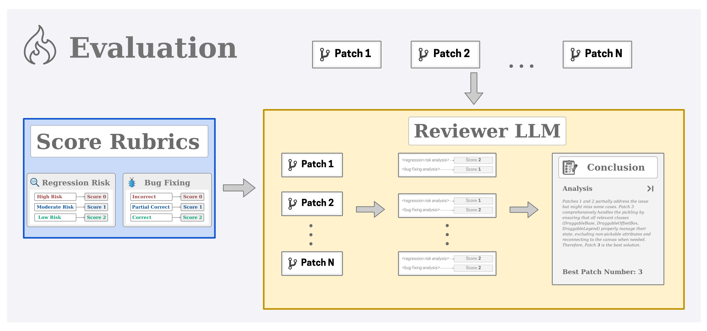

# Reviewer Dataset & Models

## Overview
This repository contains datasets and models designed for evaluating software patches and selecting the best patch for given issues. The dataset includes critiques for patches generated by AI models, and the models are fine-tuned to improve the selection of high-quality patches.

## Dataset

### Dataset Summary
The dataset includes critiques for 43k patches from 1,077 open-source Python projects. The patches are generated by Nebius's agent, and the critiques are generated by GPT-4o.

### How to Use
```python
from datasets import load_dataset
dataset = load_dataset("AGENTDARS/generated-critiques")
```

### Software Patch Evaluation Dataset
This dataset contains structured information about software patches, problem statements, evaluations, and critiques. It is designed to assess and compare different patches proposed for GitHub issues.

#### Dataset Fields
| Field Name          | Description |
|---------------------|-------------|
| `instance_id`       | A unique identifier assigned to each data instance. |
| `generated_patch`   | The code changes proposed as a fix for the given issue. |
| `patch`            | The actual patch being tested, containing modifications to the codebase. |
| `problem_statement` | A textual description of the issue that the patch is attempting to resolve. |
| `FAIL_TO_PASS`      | Test cases that fail before applying the patch but should pass after the patch application. |
| `PASS_TO_PASS`      | Test cases that pass both before and after applying the patch. |
| `p2p_failed`       | Test cases from `PASS_TO_PASS` that fail after applying the generated patch. |
| `f2p_failed`       | Test cases from `FAIL_TO_PASS` that still fail after applying the generated patch. |
| `prompt`           | The prompt used to generate the critique. |
| `critique`         | The critique generated by GPT-4o. |
| `critique_gt`      | The critique for the ground truth patch. |

The dataset is licensed under the **Creative Commons Attribution 4.0 license**. However, please respect the license of each specific repository on which a particular instance is based.

### How to Use (Larger Dataset)
```python
from datasets import load_dataset
dataset = load_dataset("AGENTDARS/reviewer-train")
```

### Dataset Statistics
| Statistic | Value |
|-----------|------|
| Total Trajectories | 80K |
| Unique Issues | 3K |
| Open-Source Repositories | 1,077 |
| Unique Patches (Total) | 42K |
| - Positive Patches | 7.3K |
| - Negative Patches | 34.7K |
| Unique Issues Correctly Solved | 837 |
| Training Examples Generated | 164K |
| Total Tokens in Training Data | ~500M |

## Models

### Reviewer-7B
- **Base Model**: `deepseek-ai/DeepSeek-R1-Distill-Qwen-7B`
- **Library**: `peft`
- **Training Methodology**: Fine-tuned using [Qwen2.5-Coder SFT](https://github.com/QwenLM/Qwen2.5-Coder/tree/main/finetuning/sft)

#### Training Details
| Hyperparameter | Value |
|--------------|---------|
| Training Regime | BF16 mixed precision |
| Optimizer | AdamW with cosine learning rate scheduler |
| LoRA Config | rank=8, alpha=32, dropout=0.1 |
| Batch Size | 48 |
| Learning Rate | 1e-5 |
| Sequence Length | 14K tokens |
| Fine-tuning Epochs | 1 |
| Compute Environment | DeepSpeed |
| Compute Infrastructure | 8x H100 |

**Results:** Achieves **38.7%** on SWE-Bench Lite.

### Reviewer-14B
- **Base Model**: `deepseek-ai/DeepSeek-R1-Distill-Qwen-14B`
- **Library**: `peft`
- **Training Methodology**: Fine-tuned using [Qwen2.5-Coder SFT](https://github.com/QwenLM/Qwen2.5-Coder/tree/main/finetuning/sft)

#### Training Details
| Hyperparameter | Value |
|--------------|---------|
| Training Regime | BF16 mixed precision |
| Optimizer | AdamW with cosine learning rate scheduler |
| LoRA Config | rank=8, alpha=32, dropout=0.1 |
| Batch Size | 48 |
| Learning Rate | 5e-6 |
| Sequence Length | 14K tokens |
| Fine-tuning Epochs | 1 |
| Compute Environment | DeepSpeed |
| Compute Infrastructure | 8x H100 |

**Results:** Achieves **41.7%** on SWE-Bench Lite.

### Reviewer-32B
- **Base Model**: `deepseek-ai/DeepSeek-R1-Distill-Qwen-32B`
- **Library**: `peft`
- **Training Methodology**: Fine-tuned using [Qwen2.5-Coder SFT](https://github.com/QwenLM/Qwen2.5-Coder/tree/main/finetuning/sft)

#### Training Details
| Hyperparameter | Value |
|--------------|---------|
| Training Regime | BF16 mixed precision |
| Optimizer | AdamW with cosine learning rate scheduler |
| LoRA Config | rank=8, alpha=32, dropout=0.1 |
| Batch Size | 32 |
| Learning Rate | 1e-6 |
| Sequence Length | 14K tokens |
| Fine-tuning Epochs | 1 |
| Compute Environment | DeepSpeed |
| Compute Infrastructure | 8x H100 |

**Results:** Achieves **42.0%** on SWE-Bench Lite.

## Evaluation

### Patch Cleaning & Scoring
Before evaluation, we:
1. **Clean patches** by removing test content and duplicates.
2. **Score patches** based on two rubrics:
   - **Bug Fixing Score**
   - **Regression Risk**
3. **Select the best patch** based on final scores.

### Performance Comparison
We tested multiple models for selecting the best patch. Below is the accuracy comparison:

#### Reviewer Performance Table

| Reviewers | GPT-4o | Gemini 1.5 Pro | Gemini 2.0 Flash | Claude 3.5 Sonnet |
|-----------|-------|---------------|-----------------|----------------|
| **Closed Source** | | | | |
| GPT-4o | 62.12 | 48.19 | 50.00 | 51.02 |
| **Open Source** | | | | |
| R1 | **71.64** | **78.31** | 64.06 | **74.49** |
| R1-Distill-7B | 53.73 | 54.22 | 56.25 | 41.84 |
| R1-Distill-14B | 65.67 | 56.63 | 54.69 | 54.08 |
| R1-Distill-32B | 67.16 | 66.27 | 62.50 | 59.18 |
| **Fine-tuned** | | | | |
| R1-Distill-7B | 55.22 | 54.22 | 57.81 | 51.02 |
| R1-Distill-14B | 71.64 | 59.04 | 60.94 | 60.20 |
| R1-Distill-32B | 70.15 | 63.86 | **65.62** | 61.22 |

**Evaluation Figure:**


## License
The dataset is licensed under the **Creative Commons Attribution 4.0 License**. Please ensure compliance with the respective repository licenses for dataset instances.

---
For further details, refer to our [repository](https://github.com/darsagent/DARS-Agent).
